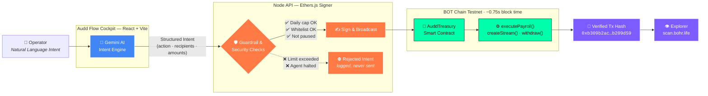

<div align="center">

# ⚡ Audd Flow — Kinetic

### The on-chain treasury & payroll cockpit that runs on intent, not spreadsheets.

**Speak your intent. The agent handles the chain.**

[](https://scan.bohr.life)
[](#)
[](#)

<br/>

### 🌐 Live Application

[](https://audd-flwo-api-server.vercel.app/)

**[audd-flwo-api-server.vercel.app](https://audd-flwo-api-server.vercel.app/)**

<br/>


</div>

---

## 🧭 The Vision

Managing an on-chain treasury today is **manual, error-prone, and risky**. Finance operators juggle raw calldata, hex addresses, gas estimation, and multi-sig approvals just to pay a contractor or top up a runway account. One fat-fingered address or misplaced decimal is irreversible.

**Audd Flow — Kinetic** replaces that surface with an **intent-centric AI cockpit**. You describe *what* you want in plain English — *"Run this month's payroll for the engineering team"* — and the system translates intent into a **guardrailed, verifiable on-chain transaction**. No calldata. No copy-pasting addresses. No silent failures.

The result is treasury operations that feel like a conversation, backed by the auditability and finality of a public ledger.

---

## 🏗️ System Architecture

The pipeline is deterministic and safety-first: **natural language never touches the chain directly**. Every intent is parsed, validated against on-chain guardrails, and only then executed — with the resulting transaction hash surfaced back to the operator for verification.



**Why this ordering matters:** the AI proposes, but the **contract disposes**. Guardrails (`dailyCap`, whitelisting, and a hard `pause`/halt switch) live in Solidity — so even a mis-parsed intent cannot exceed policy. The AI is a translator, never a signer with unlimited authority.

---

## ✨ Core Features

### 🎙️ Natural-Language Intent Parsing
Powered by **Google Gemini**, the Intent Engine turns free-form instructions into typed, structured transactions — recipients, tokens, and amounts resolved against your on-chain employee registry. Ambiguity is surfaced back to the operator, never guessed on-chain.

### 🛡️ Human-in-the-Loop Guardrails
Every AI-proposed action passes through contract-enforced checks before broadcast:
- **Daily spend caps** per token (`dailyCap` / `spentToday`)
- **Emergency halt switch** — one call pauses all agent execution
- **Recipient whitelisting** via the managed employee list
- Rejected intents are **logged and auditable**, not silently dropped.

### ⚡ Built for BOT Chain's Speed & Economics
BOT Chain's **~0.75s block time** and **near-zero fees** make it viable to settle micro-transactions and continuous flows that would be uneconomical elsewhere:
- **`executePayroll()`** — batch salary runs in a single confirmed transaction
- **`createStream()`** — per-second salary streaming with on-demand `claimStream()`
- Sub-second finality means the cockpit reflects on-chain truth almost instantly.

### 🎨 "Silent Premium" UI
A restrained, cinematic interface — deep blacks, a single kinetic accent, and motion that communicates state rather than decorates it. Treasury, Agent Console, Team, Streams, Activity, and Settings, engineered to feel like production fintech, not a hackathon demo.

---

## 📦 Hackathon Submission Details

> **BOT Chain Builder Challenge #1 — Track: AI Agent**

| Field | Value |
|-------|-------|
| 🎬 **Demo Video** | [Watch Demo on YouTube](https://youtu.be/HOTYtAoXn7k?si=NMfAx1nlrMxVYJ4r) |
| 🌐 **Live App** | [Launch Live App](https://audd-flwo-api-server.vercel.app/activity) |
| 📜 **Treasury Contract** | [`0x9e18AF3E5CD59F56f95E24fF0421A7a3ff2a7719`](https://scan.bohr.life/address/0x9e18AF3E5CD59F56f95E24fF0421A7a3ff2a7719) |
| 💵 **aUSD Token** | [`0xC053E2ECb165edE3aa54dE4E273636387A05aA98`](https://scan.bohr.life/address/0xC053E2ECb165edE3aa54dE4E273636387A05aA98) |
| 🔗 **Sample Tx Hash** | [`0xb309b2ac480f12bdb85ac2a468d16bcc38bf47f55b28b39e39039eb88b209d59`](https://scan.bohr.life/tx/0xb309b2ac480f12bdb85ac2a468d16bcc38bf47f55b28b39e39039eb88b209d59) |
| ⛓️ **Chain ID** | `968` &nbsp;(hex `0x3C8`) |
| 📡 **RPC URL** | `https://rpc.bohr.life` |
| 🔍 **Explorer** | `https://scan.bohr.life` |

---

## 🚀 Local Setup

**Prerequisites:** Node.js 20+ and [pnpm](https://pnpm.io) (this is a pnpm monorepo).

### 1️⃣ Install dependencies
```bash
pnpm install
```

### 2️⃣ Configure your environment
Add your Gemini key (and the treasury signer key) to the environment:
```bash
GEMINI_API_KEY=your_gemini_api_key
# optional — defaults are baked in for the BOT Chain testnet
BOTCHAIN_CHAIN_ID=968
```

### 3️⃣ Run the cockpit + API
```bash
# Terminal 1 — Node API backend (Ethers signer + Gemini)
pnpm --filter @workspace/api-server run dev

# Terminal 2 — React + Vite frontend cockpit
pnpm --filter @workspace/audd-flow run dev
```

Open the frontend URL Vite prints, connect to **BOT Chain Testnet (968)**, and start issuing intents. 🎉

---

<div align="center">

**Audd Flow — Kinetic** · Built on **BOT Chain** · Powered by **Gemini**

<i>Speak your intent. The agent handles the chain.</i>

</div>
